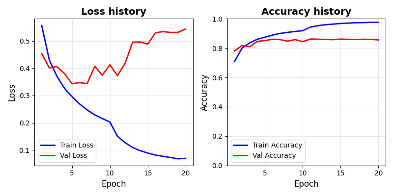
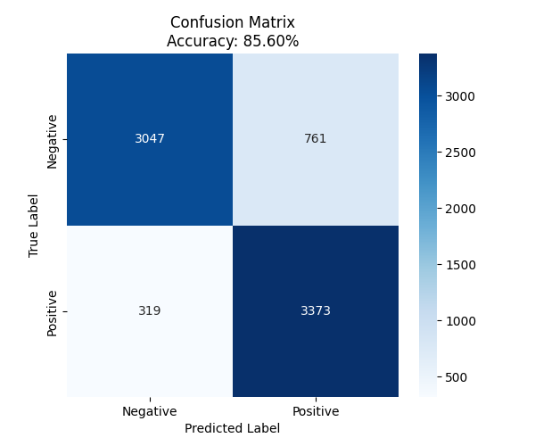

## TODO

- 1. transformer-based classifier to get sentiments (positive/negative) from reviews of movies
- 2. pipeline to tokenize words (from the raw text to vectors for words; from raw words sequence to matrices)
- 3. pytorch-based transformer classifier
- 4. training, validation and testing datasets and performance evaluations

## Tokenization

I used the tokenization method from the Hugging Face `tokenizer`, which is the industry standard for modern NLP. Internally it uses `Subword Tokenization` mechanism.

```text
# example
"discomforting" ==> ["dis", "comfort", "ing"]
```

Other treatments:

- choose to use a pre-trained model (like BERT or DistiBERT)
- allow definition of the max length of the sequences
- allow padding for short sequences
- allow pytorch-transformed tensor

## Dataset

In `IMDB_ReviewDatasets.py`, I splitted the original datasets into 70% for training, 15% for validation and 15% testing

```python
from IMDB_ReviewDatasets import train_dataset, val_dataset, test_dataset
```

## Training

```python
python train.py
```

Model configuration json, trained weights will be saved to `./results`

- `Training loss/accuracy history`: training_history_20251219_111841.csv
- `Model configurations`: model_config_20251219_111841.json
- `weights`: weights_20251219_111841.pt



## Testing

```python
# Performance on the testing dataset
python test.py
# --> generate the confusion matrix

python history_plot.py ./results/training_history_20251219_111841.csv
```

Model testing result will be saved to `./results`


