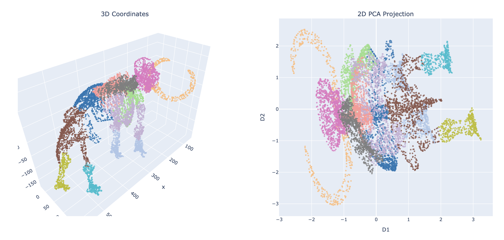

## Dimension reduction for the 3D mammoth dataset

### Dependencies
```python
pip install scikit-learn plotly numpy matplotlib
```

### Simple test run
This shows the original dataset plotted in 3D space (left panel) and also the PCA-based 2D plot (right panel):
```python
python plot.py
```



### Implementation of your own nonlinear dimension reduction technique
Principle:
1. try NOT to directly use top-level API for implementation
2. try to following the original formula/flow for the techniques (SNE, t-SNE, UMAP)
3. bonus: try to use neural network-based autoencode for dimension reduction

### Final presentation of your data
You can use the following code to present the final projection result. The only thing you need to change/create is the `data_2d` variable, which is supposed to be projection of all 3D data point. You should keep other lines.

```python
from plot import *

original_coords = get_data()
color_indices = get_colorlabels()

data_2d = ... # your projection of all 3D data point

plot(original_coords, color_indices, projected_coords=data_2d)
```
