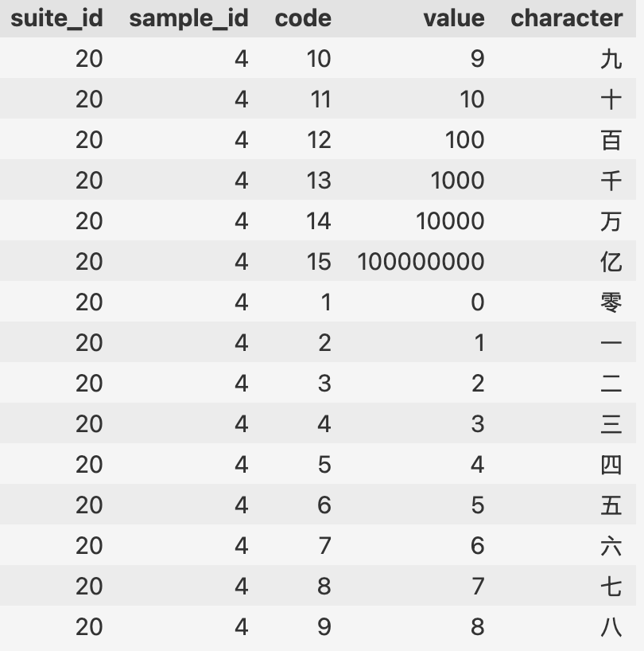

## Chinese Character MNIST
The [dataset](https://www.kaggle.com/datasets/gpreda/chinese-mnist) uploaded by Gabriel Preda on Kaggle, contains handwritten Chinese numerals produced by 100 volunteers. Each participant wrote the 15 numerals on 10 sheets, yielding 15 000 images (300×300).

### Dataset
Download via KaggleHub:
``` python
import kagglehub
kagglehub.dataset_download("gpreda/chinese-mnist")
```
The dataset includes:
* `chinese_mnist.csv` — metadata with suite_id, sample_id, code, and the character mapping (see table below).
    
    
* `data` folder with 15,000 jpg images (`input_<suite>_<sample>_<code>.jpg`)

    

### Goal
For this week, train a perceptron (or variations) to classify the handwritten characters.

### Final Remark
Use whatever you need — and have fun!

### Acknowledgements
I want to thank Gabriel Preda for preprocessed the data and uploaded to kaggle for sharing. Dr. K Nazarpour and Dr. M Chen from Newcastle University, who collected the data.