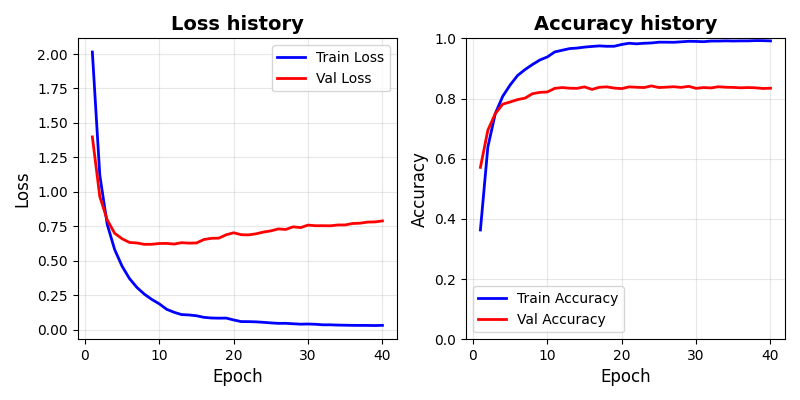
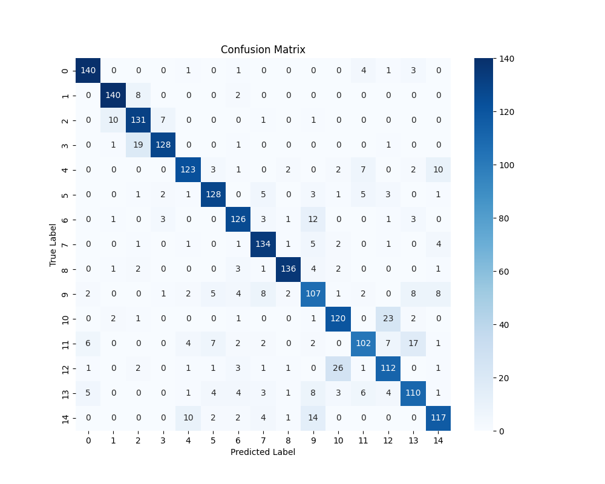

## TODO
Training CNN models for Chinese character recognition (a classifier)

## 1. dataset
dataset: the `chinese-mnist` dataset from the `kagglehub` package.
- sample number in total: 150,000.
- classes: 15 (labeled as `[0, 1, ..., 14]`).
- splitting the whole dataset into training, validation and testing dataset using the ratio of `0.7:0.15:0.15`.

The preprcessing and splitting will be dealt with in the `dataset.py`. and by:

```python
from datasets import train_dataset, val_dataset, test_dataset, device
```

We can access the prepared datasets conveniently.

## 2. FNN architecture
The `FNN.py` module defines the fully connected neural network (or perceptron). Important parameters are:
- `input_dim`: input dimension. Default: 64.
- `layer_sizes`: list of integers defining number of neurons in each hidden layer.
- `output_dim`: output dimension (class numers for classification tasks). Default: 15.
- `activation`: activation function. Choose from `relu`, `sigmoid`, `leakyrelu`, `gelu`. Default: `sigmoid`.
- `dropout`: dropout rate. If multiple layers were used, the dropout will be used for every layer. Default: 0.4.

## 3. Hyperparameter search
The `hyperparameters_search.py` performs hyperparameter search for the FNN. The current demo only searches the following
- neurons in the first hidden layer
- neurons in the second hidden layer
- dropout rate
- activation function

```bash
python hyperparameters_search.py
```
This will generate a result csv sheet `hypersearch_results.csv` in the `./results/` directory.

```python
df = pd.read_csv("./results/hypersearch_results.csv")
# the combination gives the best validation accuracy:
df.loc[df['value'].idxmax()]
# -->
    params_layer1                                256
    params_layer2                                256
    params_dropout                               0.2
    params_activation                           relu
``` 


## 4. Training
After finding out the best combination of hyperparameters, we train the model again with that hyperparamter combination with more epochs until reaching convergence.

```bash
python train.py
```

```text
Total parameters: 1,118,479
Trainable parameters: 1,118,479
Epoch [1/40] Train Loss: 2.0145, Train Acc: 0.3630 | Val Loss: 1.3991, Val Acc: 0.5711
Epoch [2/40] Train Loss: 1.1221, Train Acc: 0.6387 | Val Loss: 0.9667, Val Acc: 0.6947
...
...
...
Epoch [39/40] Train Loss: 0.0313, Train Acc: 0.9923 | Val Loss: 0.7827, Val Acc: 0.8333
Epoch [40/40] Train Loss: 0.0328, Train Acc: 0.9914 | Val Loss: 0.7899, Val Acc: 0.8342
```

The current model configuration, weights and training/validation loss and accuracy history will be stored as data files under the `./results` directory.

## 5. Loss and accuracy history
After training was finished, we can plot the loss and accuracy history using:
```python
python history_plot.py ./results/training_history_20251122_104954.csv 
```




## 6. Testing
Finally, we want to evaluate the trained model on the splited testing dataset which has never been seen by the model.

```bash
python test.py ./results/model_config*.json ./results/weights_*.pt

# -->
# Test Loss: 0.8174, Test Acc: 0.8240
```

The json file and pt file are generated during the training stage. Runing this command will directly plot the confusion matrix and print out the testing accuracy.


