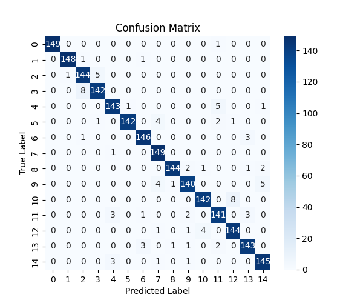
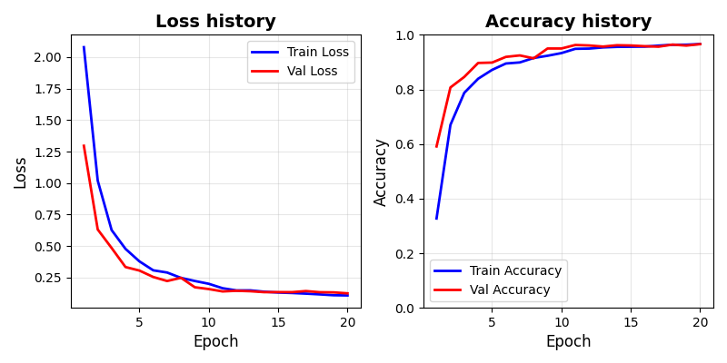

## TODO
Training CNN models for Chinese character recognition (a classifier)

## 1. dataset
dataset: the `chinese-mnist` dataset from the `kagglehub` package.
- sample number in total: 150,000.
- classes: 15 (labeled as `[0, 1, ..., 14]`).
- splitting the whole dataset into training, validation and testing dataset using the ratio of `0.7:0.15:0.15`.

The preprcessing and splitting will be dealt with in the `dataset.py`. and by:

```python
from datasets import train_dataset, val_dataset, test_dataset, device
```

We can access the prepared datasets conveniently.

## 2. CNN architecture
The `CNN_module.py` defines the CNN architecture. The module allows the following parameters when initializing an instance:
- `input_sizes`: (color_channels, width, height) of the image data. Default: `(1, 64, 64)`.
- `convol_channels`: (type: `list`) channel numbers for convolutional layers.
- `output_dim`: the number of classes. Default: 15.
- `kernel_sizes`: an integer (use the same kernel size for all convolutional layers), or a list of integers, the size of which has to match with the size of `convol_channels`. Default: 3.
- `stride`: integer, the stride when doing convolution. Default: 1.
- `padding`: integer. Default: 0 (no padding).
- `use_maxpooling_every`: integer. Default: 0 (no pooling). `1` means add one maxpooling layer after every convolutional layer.
- `pooling_size`: pooling size. Default: 2.
- `fc_layer_sizes`: list of integers, defining the final feed forward network. Default: `[]`.
- `activation`: activation function. Choose from `relu`, `sigmoid`, `leakyrelu`, `gelu`. Default: `relu`.
- `use_batchnorm`: whether to use batch normalization after each convolutional layer (but before the activation layer). Default: False.
- `dropout`: dropout rate in the feed forward network. if multiple layers were used, the dropout will be used for every layer. Default: 0.

As such, a classical and sufficiently flexible CNN architecture is built.

## 3. Hyperparameter search
We want to search for an appropriate combination of model-sepcific hyperparamters. The `hyperparameter_search.py` is designed for model-specific (such as convolution channels, filter size etc.) and training-specific (such as learning rate,random seeds) hyperparameters search.
    `python hyperparameter_search.py`
        <-- internally search for model-specific parameters and store result (as a csv) in `./results`.
        <-- internally try to report maximize the reported `validation accuracy`.

The code below shows how to examine the searching result (though it will be printed out when runing the script).

```python
df = pd.read_csv("./results/hypersearch_results.csv")
# the combination gives the best validation accuracy:
df.loc[df['value'].idxmax()]
# -->
    params_channel1                               16
    params_channel2                               32
    params_dropout                               0.2
    params_kernel_size                             3
```     

Here, I only searched for two convolutional layers with different channel numbers, dropout, and kernel size. However, more search can be done by modifying the `hyperparameter_search.py` script.


## 4. Training
`train.py`: use the best hyperparameter combination from above, we trained the model with:
```python
python train.py
```
Final results will be stored in `./results`, which will be created if not alreadt existing.
- `training_history_{timstamp}.csv`: training and validation loss history and accuracy history.
- `weights_{timestamp}.pt`: the final weight after all epochs.
- `model_config_{timestamp}.json`: the model configuration being used.

## 5. Testing
`test.py` reports the final model performance on the testing dataset for the classification task and plot the confusion matrix.

```python
python test.py ./results/model_config_20251122_093024.json ./results/weights_20251122_093024.pt
# -->
# Test Loss: 0.1390, Test Acc: 0.9609
```



## 6. Analyze the history
'historty_plot.py': plot accuracy and loss history during training.
```python
python history_plot.py ./results/training_history_20251122_093024.csv
```



